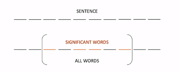
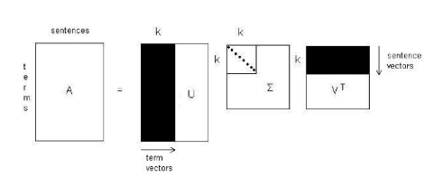
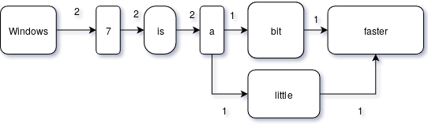
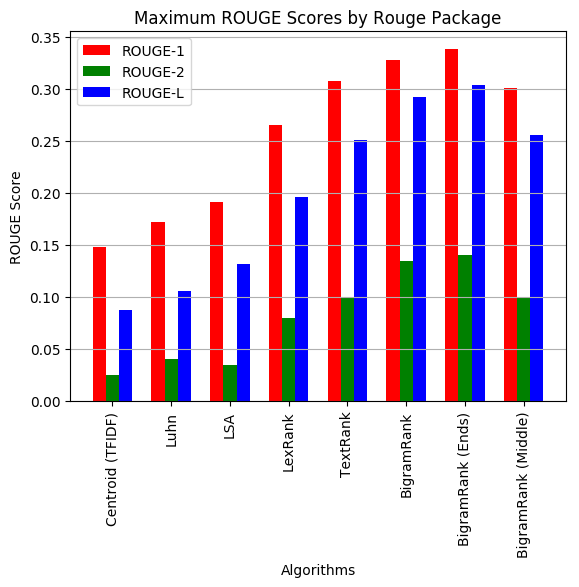
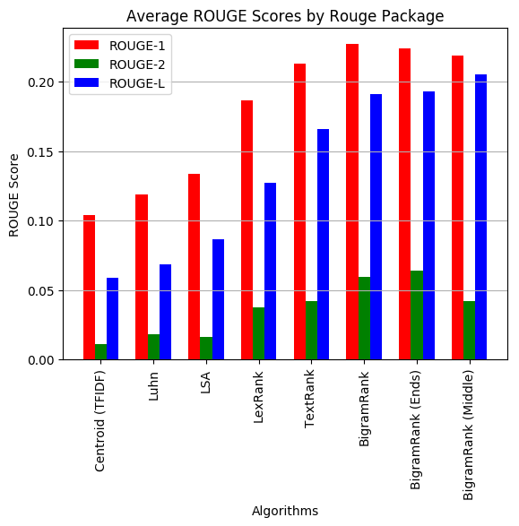
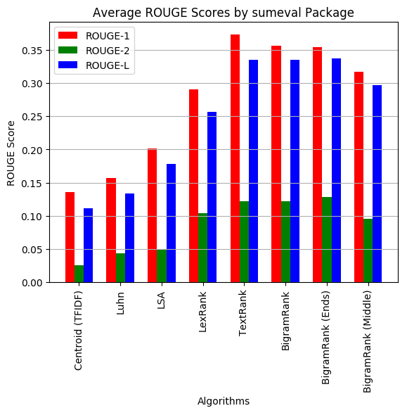

# textsum
Exploring Text Summarization Techniques

[Introduction](#introduction)
- [Abstractive Summarization](#abstractive-summarization)
- [Extractive Summarization](#extractive-summarization)
- [Metrics](#metrics)

[Baselines](#baselines)
- [Centroid](#centroid)
- [Luhn](#luhn)
- [Latent Semantic Analysis](#latent-semantic-analysis)
- [TextRank](#textrank)
- [LexRank](#lexrank)

[BigramRank](#bigramrank)
- [Ends](#ends)
- [Middle](#middle)

[Results](#results)

[Deep Learning](#deep-learning)

## Introduction
**Text Summarization** is the task of generating a short and concise summary that captures the main ideas of the source text. There are two main approaches to text summarization:
### Abstractive Summarization
Abstractive methods build an internal semantic representation of the original content, and then use this representation to create a summary that is closer to what a human might express.
The generated summaries potentially contain new phrases and sentences that may not appear in the source text.\
The current state of the art can be tracked [here](https://paperswithcode.com/task/abstractive-text-summarization)

### Extractive Summarization
Extractive methods use the original text to create a summary that is as close as possible to the original content. Here, content is extracted from the original data, but the extracted content is not modified in any way. 
Most of the techniques explored in this project are related to extractive summarization.\
The current state of the art can be tracked [here](https://paperswithcode.com/task/extractive-document-summarization)

### Metrics
The main set of metrics used to evaluate the performance of text summarization techniques are [ROUGE](https://en.wikipedia.org/wiki/ROUGE_(metric)) (Recall-Oriented Understudy for Gisting Evaluation) of which we use the following:

<!-- $ROUGE-N = \frac{\sum_{S \in \{Reference\ Summaries\}}\sum_{gram_n \in S}{Count_{match}(gram_n)}}{\sum_{S \in \{Reference\ Summaries\}}\sum_{gram_n \in S}{Count(gram_n)}}$ -->  

where  <!-- $gram_n$ -->  stands for the <!-- $n-grams$ -->  appearing in <!-- $S$ -->  or the reference summaries.\
We use the `sumeval` package which implements this method.

An  alternative implementation of the metric which uses precision, recall and F-measures provided by the `rouge` package in Python is as follows:

Precision <!-- $P_n = \frac{Count_{overlap}{(n-grams\ in\ Candidate\  and \ Reference\ Summaries)}}{Count{(n-grams\ in\ Candidate\ Summary)}}$ --> 

Recall <!-- $R_n  = \frac{Count_{overlap}{(n-grams\ in\ Candidate\  and \  Reference\ Summaries)}}{Count{(n-grams\ in\ Reference\ Summary)}}$ --> 

F-score <!-- $F = \frac{(1 + \beta^2) P_n R_n}{\beta^2 P_n + R_n}$ --> 

Another metric used is finding the longest common subsequence (LCS) between a candidate summary and the original reference summary called . Let us consider  as a reference summary of length  and  as a candidate summary of length . Here, both the `rouge` and `sumeval` packages use the same implementation as follows:

Precision <!-- $P_{lcs} = \frac{LCS(X,Y)}{n}$ --> 

Recall <!-- $R_{lcs} = \frac{LCS(X,Y)}{m}$ -->  and

F-score <!-- $F_{lcs} = \frac{(1 + \beta^2) P_{lcs}R_{lcs}}{\beta^2P_{lcs} + R_{lcs}}$ --> 

where <!-- $LCS(X,Y)$ -->  is the length of the longest common subsequence between <!-- $X$ -->  and <!-- $Y$ --> .

## Baselines
**NOTE:** A lot of the baselines explained here are implemented with the `sumy` package in Python.
### Centroid
This method is a variation of [TF-IDF](https://en.wikipedia.org/wiki/Tf-idf) where the **centroid** is the average of the TF-IDF scores of all the words in the text. 
The simple version of the TF-IDF formula is as follows:
For term <!-- $i$ -->  in document <!-- $j$ --> ,
<!-- $w_{i,j} = tf_{i,j} \times \log (\frac{N}{df_{i}})$ -->  
where <!-- $tf_{i,j} = $ -->  number of occurrences of term <!-- $i$ -->  in <!-- $j$ --> 

 the number of documents that contain <!-- $i$ --> 

 the total number of documents in the corpus.

### Luhn
This method can be extended to use abstracts/excerpts instead of complete sentences and works as follows:
- First identify the sentence which consists of the cluster containing the maximum number of **significant** words. (This can be determined by another frequency based algorithm such as TF-IDF or thresholding)
- Significance of Sentence = <!-- $\frac{[Count( significant\ words\ in\ sentence)]^2}{Count(words\ in\ sentence)}$ --> 

### Latent Semantic Analysis
Latent Semantic Analysis (LSA) applies the concept of **S**ingular **V**alue **D**ecomposition (SVD) to text summarization.
A term by sentence matrix <!-- $A = [A_1, A_2, ..., A_n]$ -->  is created with <!-- $A_k$ -->   representing the weighted term frequency of sentence <!-- $k$ -->  in the document. In a document where there are <!-- $m$ -->  terms and <!-- $n$ -->  sentences, <!-- $A$ -->  will be an <!-- $m \times n$ -->  matrix.
Given an <!-- $m \times n$ -->  matrix <!-- $A$ --> , where <!-- $m \geq n$ --> , the SVD of <!-- $A$ -->  is defined as: <!-- $U \sum V^T$ --> 

where <!-- $V$ -->  is an <!-- $n \times n$ -->  orthogonal matrix,

 is an  column-orthonormal matrix with left-singular vectors,

Σ is an <!-- $n \times n$ -->  diagonal matrix, whose diagonal elements are non-negative singular values in descending order.

For each sentence vector in matrix  (its components are multiplied by corresponding singular values) we compute its length. The reason of the multiplication is to favour the index values in the matrix  that correspond to the highest singular values (the most significant topics). Formally:
<!-- $s_k = \sqrt{\sum_{i=1}^{n}v_{k,i}^2\sigma_i^2}$ --> 
where <!-- $s_k$ -->  is the length of the vector representing the <!-- $k^{th}$ -->  sentence in the modified latent vector space.
### TextRank
TextRank is a **graph-based** model for many NLP applications, where the importance of a single sentence depends on the importance of the entire document, and with respect to other sentences in a mutually recursive fashion, similar to [HITS](https://en.wikipedia.org/wiki/HITS_algorithm) or [PageRank](https://en.wikipedia.org/wiki/PageRank).
The score of a “text unit” or vertex $V$ in a graph (here vertex $V$ could represent any lexical unit such as a token, word, phrase, or a sentence) is calculated as follows:
<!-- $WS(V_i) = (1 - d) + d \times \sum_{V_j \in In(V_i)}\frac{w_{ji}}{\sum_{V_k \in Out(V_j)}w_{jk}}WS(V_j)$ --> 

For the task of sentence (summary) extraction, the goal is to rank entire sentences, and therefore a vertex is added to the graph for each sentence in the text. Two sentences are connected if there is a “similarity” relation between them, where “similarity” is measured as a function of their content overlap (common tokens). For two sentences <!-- $S_i$ -->  and <!-- $S_j$ -->  the similarity between them is:

<!-- $Sim(S_i, S_j) = \frac{|\{w_k | w_k \in S_i \&\ w_k \in S_j \}|}{\log(|S_i|) + \log(|S_j|)}$ -->  
where  <!-- $w_k$ -->   is a token / "text unit" in the sentences.

TextRank takes into account both the local context of a text unit (vertex) and the information recursively drawn from the entire text document (graph).

This could be enhanced  by considering the text units as words and then giving an improved similarity score to the sentences by considering PageRank scores of tokens between <!-- $S_i$ -->  and <!-- $S_j$ --> 
### LexRank
Another graph-based model for many NLP applications, this method performs **random walks** or **random traversals** through the graph, where the lexical unit or vertex  is a sentence, this time it uses the *centrality* of each sentence in a document (cluster) to rank the sentences.

Here, the  similarity score between two sentences <!-- $x$ -->  and <!-- $y$ -->  is given as:
<!-- $idf-modified-cosine(x,y) = \frac{\sum_{w \in (x, y)}tf_{w,x}tf_{w,y}(idf_w)^2}{\sqrt{\sum_{x_i \in x}(tf_{x_i,x}idf_{x_i})^2} \times {\sqrt{\sum_{y_i \in y}(tf_{y_i,y}idf_{y_i})^2}}}$ --> 

where <!-- $tf_{w,s}$ -->  is the number of occurrences of word <!-- $w$ -->  in sentence <!-- $s$ --> , and <!-- $idf_{w}$ -->  is the inverse document frequency of word <!-- $w$ --> .

This is an example of a weighted-cosine similarity graph generated for a cluster where <!-- $d_is_j$ -->  represents document i, sentence j.

### BigramRank
We proposed a new algorithm BigramRank as a new **graph based model** which considers the basic lexical unit as bigrams (two consecutive tokens/words). This considers the frequency of bigrams (two consecutive words) and assigns the sentence relevance score for a sentence <!-- $S$ -->  as:
Sentence Relevance Score of S is given as:
 <!-- $Score(S) = \frac{\sum_{Bigrams \in S}Bigrams}{\sum_{Bigrams \in Document}Bigrams}$ --> 
 

This is the graph generated for the sentences “Windows 7 is a bit faster. Windows 7 is a little faster.” The bigram (Windows, 7) occurs 2 times, (little, faster) occurs 1 time.
#### Ends
The bigrams at the beginning and end of the sentence are considered slightly more important than bigrams occurring at the middle of a sentence, under the assumption that human readers may just **skim through the beginning and end of a large sentence** to look for the meaning of what the sentence conveys. To do this, the existing bigram frequency weights are multiplied elementwise by a **kernel**, which is <!-- $[1...0...1]$ -->  which has weights decreasing from <!-- $[1, 0]$ -->  gradually in steps of <!-- $\frac{2}{(length\ of\ sentence-1)}$ -->   (where the weight is 0 at the exact middle bigram of the sentence, which means the middle/median bigram is not relevant to the sentence) and then increases from <!-- $[0, 1]$ --> , again in steps of  <!-- $\frac{2}{(length\ of\ sentence-1)}$ --> 
Eg: - Kernel of length 5 is <!-- $[1,0.5,0,0.5,1]$ --> , length 4 is <!-- $[1,0,0,1]$ --> , length 9 is <!-- $[1,0.75,0.5,0.25,0,0.25,0.5,0.75,1]$ --> 
#### Middle
This assumes the opposite, that is, when humans read a sentence, they may tend to **skip to the middle part of a sentence to get information and the beginning is full of transition words/conjunctions.** In this case, the rest of the algorithm remains same and the **kernel gets flipped**, that is, first an increase from  in steps of  and then a decrease from  with the same step.

Eg: - Kernel of length 5 is <!-- $[0,0.5,1,0.5,0]$ --> , length 4 is <!-- $[0,1,1,0]$ --> , length 9 is <!-- $[0,0.25,0.5,0.75,1,0.75,0.5,0.25,0]$ --> 

This is based on <!-- $ Number\ of\ bigrams = Length\ of\ sentence - 1$ --> 

### Results
The metrics were measured in two ways, each with both the [`sumeval`](https://pypi.org/project/sumeval/) and [`rouge`](https://pypi.org/project/rouge/) packages for each document and then averaged over all documents.
1) The average ROUGE scores with all the available gold standard summaries were taken (on-average performance) for each document.
2) The maximum ROUGE score of the available gold summaries (of a document) was taken to be the ROUGE score (for that document) (max performance). 

##### Maximum Performance, Rouge Package
| **Algorithm**       | **ROUGE-1** | **ROUGE-2** | **ROUGE-L** |
| ------------------- | ----------- | ----------- | ----------- |
| Centroid (TFIDF)    | 0.149       | 0.025       | 0.087       |
| Luhn                | 0.172       | 0.040       | 0.106       |
| LSA                 | 0.192       | 0.034       | 0.131       |
| LexRank             | 0.265       | 0.080       | 0.196       |
| TextRank            | 0.308       | 0.099       | 0.251       |
| BigramRank          | 0.328       | 0.134       | 0.292       |
| BigramRank (Ends)   | **0.338**   | **0.140**   | **0.303**   |
| BigramRank (Middle) | 0.301       | 0.100       | 0.255       |

##### Average Performance, Rouge Package
| **Algorithm**       | **ROUGE-1** | **ROUGE-2** | **ROUGE-L** |
| ------------------- | ----------- | ----------- | ----------- |
| Centroid (TFIDF)    | 0.104       | 0.011       | 0.058       |
| Luhn                | 0.119       | 0.018       | 0.068       |
| LSA                 | 0.134       | 0.016       | 0.086       |
| LexRank             | 0.186       | 0.037       | 0.127       |
| TextRank            | 0.213       | 0.042       | 0.166       |
| BigramRank          | **0.227**   | 0.060       | 0.191       |
| BigramRank (Ends)   | 0.224       | **0.064**   | 0.193       |
| BigramRank (Middle) | 0.219       | 0.042       | **0.205**   |

##### Maximum Performance, SumEval Package
| **Algorithm**       | **ROUGE-1** | **ROUGE-2** | **ROUGE-L** |
| ------------------- | ----------- | ----------- | ----------- |
| Centroid (TFIDF)    | 0.135       | 0.026       | 0.112       |
| Luhn                | 0.156       | 0.043       | 0.133       |
| LSA                 | 0.202       | 0.049       | 0.179       |
| LexRank             | 0.290       | 0.104       | 0.257       |
| TextRank            | **0.373**   | 0.122       | 0.335       |
| BigramRank          | 0.356       | 0.122       | 0.335       |
| BigramRank (Ends)   | 0.354       | **0.128**   | **0.337**   |
| BigramRank (Middle) | 0.317       | 0.096       | 0.297       |

##### Average Performance, SumEval Package
| **Algorithm**       | **ROUGE-1** | **ROUGE-2** | **ROUGE-L** |
| ------------------- | ----------- | ----------- | ----------- |
| Centroid (TFIDF)    | 0.089       | 0.011       | 0.073       |
| Luhn                | 0.105       | 0.019       | 0.092       |
| LSA                 | 0.138       | 0.020       | 0.122       |
| LexRank             | 0.189       | 0.038       | 0.166       |
| TextRank            | **0.248**   | **0.053**   | **0.229**   |
| BigramRank          | 0.241       | 0.051       | 0.228       |
| BigramRank (Ends)   | 0.235       | 0.052       | 0.222       |
| BigramRank (Middle) | 0.219       | 0.042       | 0.205       |

### Deep Learning
Coming soon!
